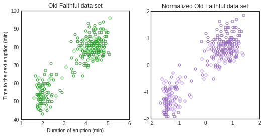
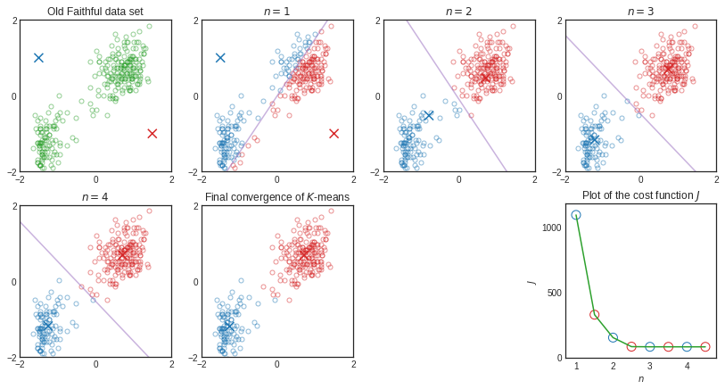
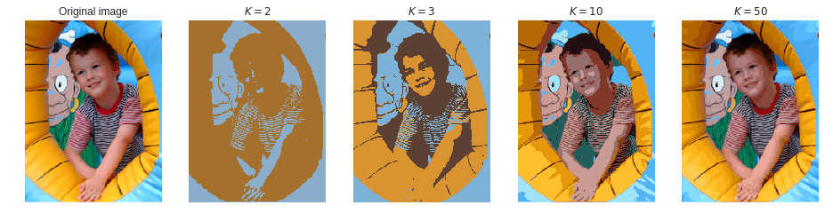
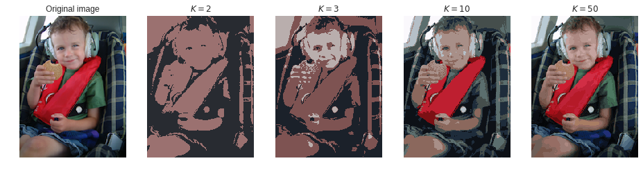

# Chapter 9. Mixture Models and EM

```python
import numpy as np
import matplotlib as mpl
import matplotlib.pyplot as plt
%matplotlib inline

mpl.style.use('seaborn-white')
```

### 올드페이스풀 데이터

올드페이스풀([Old Faithful](https://en.wikipedia.org/wiki/Old_Faithful))은 미국 와이오밍 주 옐로스톤 국립공원 안에 있는 아주 유명한 간헐천(geyser)이다.
총 272개의 관측 데이터로 이루어져 있는 올드페이스풀 데이터는 두 가지 컬럼으로 구성되어 있는데, 하나는 분출 지속시간이고 다른 하나는 다음 분출까지의 시간이다. 모든 데이터의 시간 단위는 분(min)이다.
그림 A.5는 분출 지속시간을 $x$축으로, 그리고 다음 분출까지의 시간을 $y$축으로 데이터를 표시한 것으로, $y$값에 해당하는 다음 분출까지의 시간이 비교적 다양하게 분포되어 있어 보이지만 $x$값인 분출 지속시간을 알고 있다면 좀 더 정확하게 $y$값을 예측할 수 있어 보인다.


```python
from pandas import read_csv
from sklearn.preprocessing import scale

# Scaling with pandas:
#     normalized_df = (df - df.mean()) / df.std()
#     normalized_df = (df - df.min()) / (df.max() - df.min())
data = read_csv('Old_Faithful.csv', header=None).values
data_scaled = scale(data)

fig, (ax1, ax2) = plt.subplots(ncols=2, figsize=(8.5,4))

kwargs = dict(markersize=5, markerfacecolor='none')   

# *data.T extracts data[:,0], data[:,1]
ax1.plot(*data.T, 'o', markeredgecolor='C2', **kwargs)
ax1.set(xlabel='Duration of eruption (min)', ylabel='Time to the next eruption (min)', xlim=(1, 6), ylim=(40, 100),
        title='Old Faithful data set')

ax2.plot(*data_scaled.T, 'o', markeredgecolor='C4', **kwargs)
ax2.set(aspect='equal', xlim=(-2, 2), ylim=(-2, 2), xticks=np.arange(-2, 2.1), yticks=np.arange(-2, 2.1),
        title='Normalized Old Faithful data set');
```

    /home/miniconda3/envs/devel/lib/python3.7/site-packages/sklearn/utils/__init__.py:4: DeprecationWarning: Using or importing the ABCs from 'collections' instead of from 'collections.abc' is deprecated, and in 3.8 it will stop working
      from collections import Sequence





**Figure A.5** Plot of the time to the next eruption in minutes (vertical axis) versus the duration of the eruption in minutes (horizontal axis) for the Old Faithful data set.

# 9.1 K-means Clustering

$D$차원 실수값을 가지는 확률변수 $\boldsymbol{x}$에 대해 $N$개의 관측 데이터 $\{\boldsymbol{x}_1,\dotsc,\boldsymbol{x}_N\}$가 주어졌을 때, 이 데이터를 $K$개의 클러스터로 나누고자 한다. (단, 클러스터의 수 $K$는 미리 주어졌다고 하자.)

### 1-of-$K$ coding scheme (label)

  - 각 데이터 $\boldsymbol{x}_n$이 어떤 클러스터에 속해 있는지는 $K$차원 이진 벡터인 클러스터 라벨 $\boldsymbol{r}_n=(r_{n1},\dotsc,r_{nK})^T$으로 표시한다.
    * $\boldsymbol{x}_n$이 클러스터 $k$에 속하면 $r_{nk}=1$, 그리고 나머지 $j\neq k$에 대해 $r_{nj}=0$.
      따라서 $r_{nj}\in\{0,1\}$이고, 모든 $n$에 대해 $\sum_j r_{nj}=1$.

### Distortion measure (inertia)

  - 각 데이터 $\boldsymbol{x}_n$과 그 데이터가 속한 클러스터의 센터 $\boldsymbol{mu}_k=\sum_j r_{nj}\boldsymbol{mu}_j$ 사이의 거리를 제곱한 값을 모든 데이터들에 대해 더한 것을 목적함수 $J$로 둔다.
  $$
  J = \sum_n \| \boldsymbol{x}_n - \boldsymbol{mu}_k \|^2 = \sum_n \| \boldsymbol{x}_n - \sum_j r_{nj} \boldsymbol{mu}_j \|^2 = \sum_n^N \sum_j^K r_{nj} \| \boldsymbol{x}_n - \boldsymbol{mu}_j \|^2 \tag{9.1}
  $$

### $K$-means algorithm

$K$-평균 알고리즘은 목적함수 $J$를 최소화하는 **클러스터 라벨** $\{\boldsymbol{r}_n=(r_{n1},\dotsc,r_{nK})^T\}_{n=1}^N$과 **클러스터 센터** $\{\boldsymbol{mu}_k\}_{k=1}^K$를 찾는다.

  1. 먼저 임의의 값으로 클러스터 센터 $\{\boldsymbol{mu}_k\}$를 정한다.
  
  2. (**E step: Find labels $\boldsymbol{r}_n$**) 첫 번째 단계에서는 $\boldsymbol{mu}_k$를 고정한 상태에서 $J$를 최소화하는 $r_{nk}$를 찾는다.
    - 각 데이터 $\boldsymbol{x}_n$에 대해 센터 $\boldsymbol{mu}_k$가 가장 가까운 클러스터를 지정하면 된다.
    $$
    r_{nk} = \begin{cases} 1 & \text{if $k=\arg\min_j\|\boldsymbol{x}_n-\boldsymbol{mu}_j\|^2$} \\ 0 & \text{otherwise} \end{cases} \tag{9.2}
    $$
  
  3. (**M step: Find centers $\boldsymbol{mu}_k$**) 두 번째 단계에서는 $r_{nk}$를 고정한 상태에서 $J$를 최소화하는 $\boldsymbol{mu}_k$를 찾는다.
    - 목적함수 $J$가 변수 $\boldsymbol{mu}_k$에 대한 이차함수이므로 미분을 이용하면
    $$
    \boldsymbol{0} = \frac{\partial}{\partial\boldsymbol{mu}_k} J = -2\sum_n r_{nk}(\boldsymbol{x}_n-\boldsymbol{mu}_k) \tag{9.3}
    $$
    센터 $\boldsymbol{mu}_k$는 클러스터 $k$에 속하는 모든 데이터들의 평균(**cluster mean**)이 된다.
    $$
    \boldsymbol{mu}_k = \frac{\sum_n r_{nk} \boldsymbol{x}_n}{\sum_n r_{nk}} = \frac{1}{N_k}\sum_n r_{nk}\boldsymbol{x}_n \tag{9.4}
    $$
    이 때 $N_k=\sum_n r_{nk}$는 클러스터 $k$에 들어있는 데이터들의 수이다.
    
  4. 위의 두 단계를 반복해서 라벨과 센터를 찾아간다. 더 이상 변화가 없거나 정해진 반복횟수를 넘게 되면 멈춘다.

> 이 알고리즘의 각 단계에서 목적함수 $J$가 계속 줄어들기 때문에 $J$는 특정한 값으로 수렴한다. 이 수렴값은 극솟값이지만 **최솟값이 아닐 수 있다**.


```python
from sklearn.cluster import k_means
from sklearn.utils.extmath import row_norms
from functools import reduce

def k_means_single(X, centers, n_clusters=2):
    # From 0.19.2 _labels_inertia() changed to
    # _labels_inertia(X, sample_weight, x_squared_norms, centers, precompute_distances=True, distances=None)
    from sklearn.cluster.k_means_ import _labels_inertia
    # From 0.19.2 _centers_dense() changed to
    # _centers_dense(X, sample_weight, labels, n_clusters, distances)
    from sklearn.cluster._k_means import _centers_dense

    # These arguments must be allocated before sending to _labels_inertia
    sample_weight = np.ones(X.shape[0], dtype=X.dtype)
    x_squared_norms = row_norms(X, squared=True)
    distances = np.zeros(shape=(X.shape[0],), dtype=X.dtype)
    
    # E step of the K-means EM algorithm
    labels_, inertia_ = _labels_inertia(X, #sample_weight, # scikit-learn 0.19.2
        x_squared_norms, centers, precompute_distances=False, distances=distances)

    # M step of the K-means EM algorithm
    centers_new = _centers_dense(X, #sample_weight, # scikit-learn 0.19.2
        labels_, n_clusters, distances)

    return centers_new, labels_, inertia_

def compute_inertia(X, labels, centers, n_clusters=2):
    return reduce(np.add, # generator is a little bit faster than list comprehension
        (np.sum(row_norms(X[labels == i] - centers[i], squared=True)) for i in range(n_clusters)))

def draw_scatter(ax, X, label, centers, title=None, bisector=True):
    kwargs = dict(markersize=5, markerfacecolor='none', alpha=0.5)   
    if label is None:
        ax.plot(*X.T, 'o', markeredgecolor='C2', **kwargs)
    else:
        ax.plot(*X[labels == 0].T, 'o', markeredgecolor='C0', **kwargs)
        ax.plot(*X[labels == 1].T, 'o', markeredgecolor='C3', **kwargs)
        if bisector:
            centers_mid = centers.mean(axis=0)
            bisector_l = lambda x: centers_mid[1] - (x-centers_mid[0]) * \
                (centers[1,0]-centers[0,0]) / (centers[1,1]-centers[0,1])
            ax.plot([-2, 2], [bisector_l(-2), bisector_l(2)], color='C4', alpha=0.5)
    ax.scatter(*centers.T, s=100, c=['C0', 'C3'], marker='x')
    ax.set(aspect='equal', xlim=(-2, 2), ylim=(-2, 2), xticks=[-2, 0, 2], yticks=[-2, 0, 2],
           title=title)

num = 4

fig = plt.figure(figsize=(14,7))

ax1 = fig.add_subplot(2, num, 1)
ax2 = fig.add_subplot(2, num, num+2)
ax3 = fig.add_subplot(2, num, 2*num)
iax = [fig.add_subplot(2, num, i+2) for i in range(num)]

centers_init = np.asarray([[-1.5, 1], [1.5, -1]])
draw_scatter(ax1, data_scaled, None, centers_init, title='Old Faithful data set')

inertia_l = []
centers_old = centers_init
for i in range(num):
    centers, labels, inertia = k_means_single(data_scaled, centers_old)
    
    # Append the inertia of E step (according to centers_old & labels)
    inertia_l.append(inertia)
    # Append the inertia of M step (according to centers_new & labels)
    inertia = compute_inertia(data_scaled, labels, centers)
    inertia_l.append(inertia)
    
    draw_scatter(iax[i], data_scaled, labels, centers_old, title='$n={}$'.format(i+1))
    centers_old = centers

centers, labels, inertia = k_means(data_scaled, 2, init=centers_init, n_init=1, algorithm='full') # max_iter=300 (default)
draw_scatter(ax2, data_scaled, labels, centers, title='Final convergence of $K$-means', bisector=False)

ax3.plot(np.arange(1, num+1, 0.5), inertia_l, color='C2')
ax3.scatter(np.arange(1, num+1, 0.5), inertia_l, s=100, c='none', edgecolors=['C0', 'C3'], marker='o')
ax3.set(xlabel='$n$', ylabel='$J$', xticks=np.arange(1, num+1), yticks=[0, 500, 1000],
        title='Plot of the cost function $J$');
```





**Figure 9.1** Illustration of the $K$-means algorithm using the re-scaled Old Faithful data set.

**Figure 9.2** Plot of the cost function $J$ given by (9.1) after each E step (blue points; old **centers** and new **labels**) and M step (red points; new **labels** and new **centers**) of the $K$-means algorithm for the example shown in Figure 9.1.

## 9.1.1 Image segmentation and compression

$K$-평균 알고리즘은 **손실(lossy) 데이터 압축**을 하는데 사용된다.

  - 주어진 $N$개의 데이터를 $k$개의 클러스터로 나눈 후, $N$개의 클러스터 라벨과 $K$개의 클러스터 센터만 저장한다. 만약 $K\ll N$이면 데이터 저장 공간을 상당히 아낄 수 있다.
  
  - 각 데이터는 가장 가까운 클러스터 센터로 근사한다고 볼 수 있다. 새로운 데이터가 주어지면, 먼저 가장 가까운 센터 $\boldsymbol{mu}_k$를 찾은 다음 라벨 $k$만 저장한다.
  
  - 이러한 기법을 **벡터 양자화(vector quantization)**라 부르고, 센터 $\boldsymbol{mu}_k$를 **코드북(code-book) 벡터**라 부른다.


```python
from sklearn.cluster import k_means

def vector_quantization(fname, k_l):
    from matplotlib.image import imread
    image = imread(fname) # support PNG only
    channels = image.shape[-1]

    fig, iax = plt.subplots(ncols=len(k_l)+1, figsize=(2.5*len(k_l)+6,4))
    iax[0].imshow(image)
    iax[0].set_title('Original image')

    data = image.reshape((-1, channels))

    for i, k in enumerate(k_l):
        centers, labels, _ = k_means(data, k)
        # NOTE: numpy.choose only work for k < 32; a restriction on the size of choices
        #     data_n = np.choose(np.tile(labels, (channels,1)).T, centers)
        # To avoid this restriction, we use a direct way
        data_n = np.zeros_like(data)
        for j in range(data_n.shape[0]):
            data_n[j] = centers[labels[j]]

        iax[i+1].imshow(data_n.reshape(image.shape))
        iax[i+1].set_title('$K={}$'.format(k))

    for ax in iax:
        ax.set_axis_off()
        
%time vector_quantization('originalA.png', [2, 3, 10, 50])
%time vector_quantization('originalB.png', [2, 3, 10, 50])
```

    CPU times: user 3min 36s, sys: 20.1 s, total: 3min 56s
    Wall time: 12.4 s
    CPU times: user 3min 12s, sys: 16.4 s, total: 3min 28s
    Wall time: 12.9 s








**Figure 9.3** Two examples of the application of the $K$-means clustering algorithm to image segmentation showing the initial images together with their $K$-means segmentations obtained using various values of $K$. This also illustrates of the use of vector quantization for data compression, in which smaller values of $K$ give higher compression at the expense of poorer image quality.

  - 원본 이미지가 $N$개의 픽셀로 이루어져 있고, 각 픽셀은 8비트 {R, G, B} 색상으로 표현된다면, 전체 이미지를 전송하는데 $24N$ 비트가 필요하다. 그림 9.3의 원본 이미지는 $N=240\times180=43,200$ 픽셀을 가진다.

  - 원본 이미지에 대해 $K$-평균 알고리즘을 적용한 후, 원본 이미지 전체를 전송하는 대신 **라벨**만을 전송한다고 하자. 이 경우 픽셀 당 $\log_2 K$ 비트가 든다. 또한 $K$개의 **센터**를 전송하는데 $24K$ 비트가 필요하므로, 이미지를 전송하는데 드는 비트의 수는 모두 $24K + N \log_2 K$ (rounding up to the nearest integer) 이다.
  
  - 그림 9.3의 경우, 압축 이미지를 전송하는데 43,248 비트 ($K=2$), 68,542 비트 ($K=3$), 143,747 비트 ($K=10$), 245,015 비트 ($K=50$) 가 필요하다. 원본이미지 대비 압축률은 각각 4.2% ($K=2$), 6.6% ($K=3$), 13.9% ($K=10$), 23.6%  ($K=50$) 이다.
  
  - 압축 수준과 이미지 품질 사이에는 트레이드오프(trade-off)가 있다. 만약 좋은 품질의 압축을 원한다면, 픽셀 단위로 $K$-평균 알고리즘을 적용하는 대신 인접한 픽셀들로 이루어진 작은 블록 (예를 들어 $5\times5$) 단위로 $K$-평균 알고리즘을 적용하는 것을 고려해 보자. 자연스런 이미지에 나타나는 인접한 픽셀들 사이의 연관성을 살릴 수 있다.
